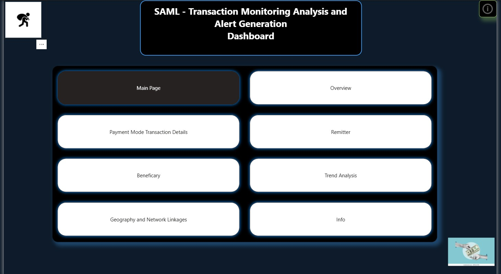
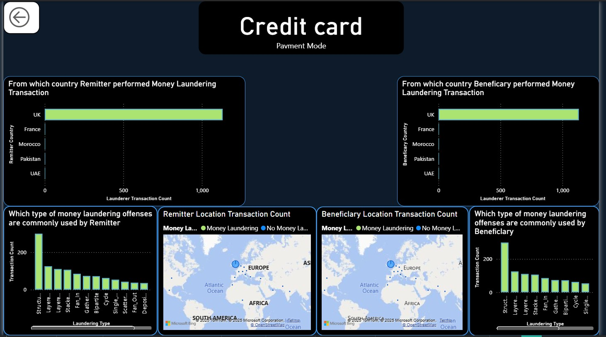
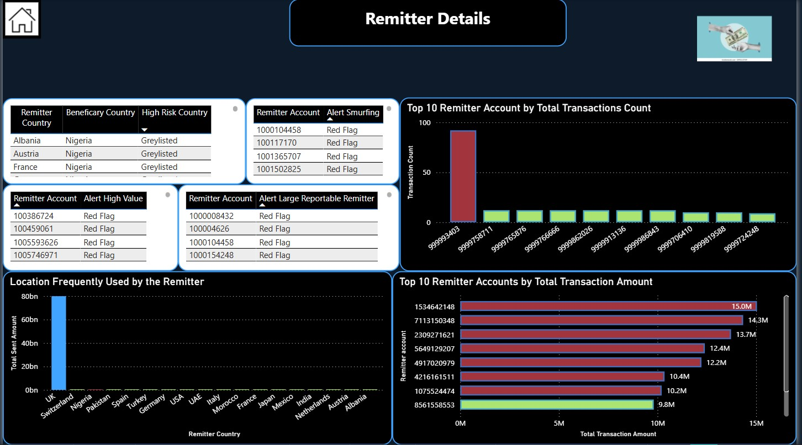
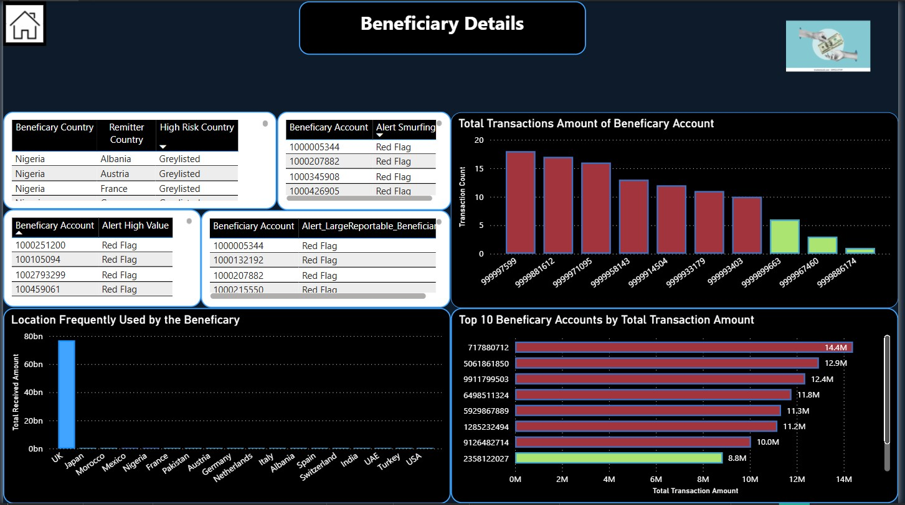
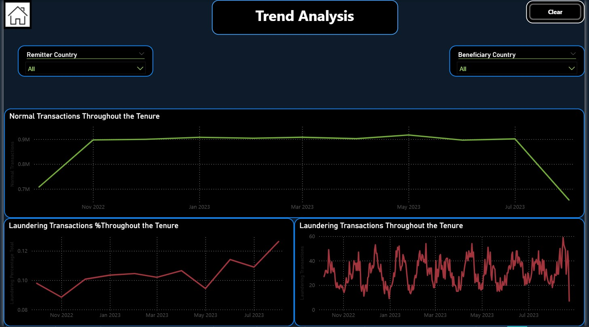
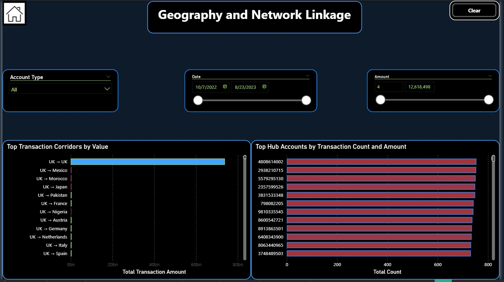

# AML_Powerbi_dashboard

# 🏦 Synthetic Transaction Monitoring Dashboard (AML)

This Power BI project visualizes synthetic financial transactions to identify potential **Anti-Money Laundering (AML)** risks.  
It is based on the [Synthetic Transaction Monitoring Dataset (AML)](https://www.kaggle.com/datasets/berkanoztas/synthetic-transaction-monitoring-dataset-aml) from Kaggle.

---

## 📊 **Project Overview**

The goal of this dashboard is to demonstrate how AML analysts and compliance teams can use **Power BI** to monitor transactions, detect suspicious behavior, alert generation from red flags shared by the Central Bank like Large Reportable, Structuring, High Value and High Risk Geography and drill into high-risk activity such as **smurfing, large cash transactions, or high-risk geography transfers**.

---

## ⚙️ **Key Features**

### 1. **Transaction Behavior Analysis**
- Total and average transaction amount per **payment type**
- Top sender and receiver accounts by total transaction value
- Interactive pie and bar charts to explore transaction patterns

### 2. **Alert Monitoring**
- Smurfing Alerts  
- High-Risk Geography Alerts  
- Large Reportable Transactions  
- Network Linkages

### 3. **Drill-through Investigation Pages**
- **Payment Type Drillthrough:** Displays detailed transactions for different payment type 
- Includes KPIs such as Total Amount, Average Amount, and Transaction Count

### 4. **KPI Summary Cards**
- **Total Transactions**
- **Total Transaction Value**
- **Average Transaction Value**
- **High-Risk Alerts Count**

### 5. **Dynamic Filters & Slicers**
- Interactive **date and amount slicers**
- Drill-down and drill-through for transaction-level insights

---

## 📈 **Visuals Included**
| Visualization | Purpose |
|----------------|----------|
| Donut Chart | Payment Type Distribution |
| Bar Chart | Top 10 Senders / Receivers |
| Line Chart | Transaction Trends Over Time |
| KPI Cards | High-level performance metrics |
| Table | Detailed transaction data for investigation |

---

## 🧮 **DAX Measures Used**
```DAX
Total Transaction Amount = SUM('Transactions'[Amount])
Average Transaction Amount = AVERAGE('Transactions'[Amount])
Transaction Count = COUNTROWS('Transactions')
High Risk Alerts = COUNTROWS(FILTER('Transactions', 'Transactions'[HighRiskFlag] = "Yes"))

🧠 Business Insights

Certain payment types show unusually high transaction values.

A few sender accounts dominate outgoing high-value transfers.

Smurfing patterns detected via repeated small transactions under reporting threshold.

Geographic clustering highlights cross-border transfers to high-risk regions.

### 🔹 Main Dashboard


### 🔹 Overview


### 🔹 Payment mode Transaction Detail


### 🔹 Remitter


### 🔹 Beneficiary


### 🔹 Trend Analysis


### 🔹 Geography and Network Linkages


### 🔹 Info


🧩 How to Use

Download the .pbix file from this repository.

## 📂 Power BI File
[Download Project File (https://drive.google.com/file/d/11wt7Wagsxbr5tRIIhlg-sQdo9G6QTAkn/view?usp=drive_link)

Open in Power BI Desktop.

Use slicers to explore data across different time periods or transaction types.

Right-click any sender or receiver → Drillthrough → to view their transaction history.

You can go to info page by click info icon on the main page to get to know about the terminologies used in the dashboard

🛠️ Tools & Technologies

Power BI Desktop

DAX (Data Analysis Expressions)

Kaggle Synthetic AML Dataset

MySQl (for preprocessing)

Data Modeling and ETL

📁 Project Structure
📂 AML-PowerBI-Project
 ┣ 📜 README.md
 ┣ 📊 AML_Dashboard.pbix
 ┣ 📈 Dataset.csv (optional link to Kaggle)
 

👨‍💼 About the Author

Imran Akbar — AML & IT Project Management Professional
10+ years in Compliance, Sanctions, and Financial Crime Systems
Passionate about leveraging data and automation to strengthen AML frameworks.
🌐 LinkedIn
www.linkedin.com/in/mr-imran-akbar
